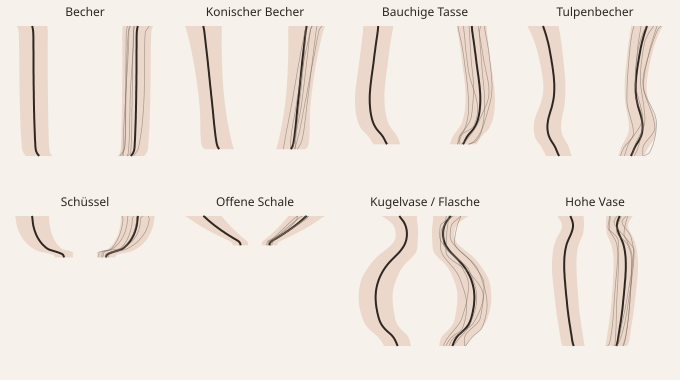

# Formen-Datenbank: Analyse

Erzeugt mit `npm run formen` am 2026-10-03.

Die Datenbank (`formen-db.json`) enthält **3200 Gefäßkonturen** aus 8 Formfamilien
gedrehter Gebrauchskeramik. Jede Kontur ist als Radius/Höhe an 48 Stellen von der Öffnung bis zum Boden gespeichert.
2575 Stücke wurden zum Lernen benutzt, 625 zurückgehalten und nur zum Prüfen verwendet.

> Hinweis: Die Konturen stammen aus Bauregeln typischer Formen (Proportionen, Fuß, Bauch, Taille, Schulter, Hals, Lippe;
> siehe `typologie.mjs`), nicht aus Fotos. Eigene Profile lassen sich ergänzen – einfach weitere Einträge mit
> `familie` und `profil` in `formen-db.json` aufnehmen und `npm run formen` erneut ausführen.

## Linienführung je Formfamilie

Median, in Klammern 10.–90. Perzentil.

| Familie | Stück | Höhe : Ø | Weiteste Stelle (von oben) | Ø Öffnung / Ø max | Ø Boden / Ø max | Wendepunkte | Steilste Wandneigung |
|---|---|---|---|---|---|---|---|
| Becher | 400 | 1,23 (1,03–1,51) | 0 % (0 %–79 %) | 1,00 (0,97–1,00) | 0,87 (0,78–0,95) | 0 (0–1) | 35° (11°–58°) |
| Konischer Becher | 400 | 1,17 (0,97–1,46) | 0 % (0 %–91 %) | 1,00 (0,82–1,00) | 0,65 (0,56–0,91) | 0 (0–1) | 27° (13°–52°) |
| Bauchige Tasse | 400 | 1,07 (0,90–1,29) | 64 % (51 %–72 %) | 0,84 (0,75–0,93) | 0,68 (0,58–0,78) | 1 (0–2) | 46° (29°–63°) |
| Tulpenbecher | 400 | 1,23 (1,03–1,52) | 0 % (0 %–77 %) | 1,00 (0,95–1,00) | 0,68 (0,58–0,80) | 2 (1–2) | 42° (27°–58°) |
| Schüssel | 400 | 0,38 (0,32–0,50) | 0 % (0 %–9 %) | 1,00 (0,98–1,00) | 0,39 (0,31–0,48) | 2 (1–3) | 79° (72°–83°) |
| Offene Schale | 400 | 0,28 (0,23–0,37) | 0 % (0 %–0 %) | 1,00 (1,00–1,00) | 0,28 (0,21–0,35) | 2 (1–4) | 64° (56°–72°) |
| Kugelvase / Flasche | 400 | 1,29 (1,06–1,75) | 60 % (51 %–68 %) | 0,49 (0,32–0,73) | 0,54 (0,43–0,66) | 2 (1–3) | 56° (46°–65°) |
| Hohe Vase | 400 | 2,08 (1,63–2,87) | 32 % (17 %–43 %) | 0,78 (0,60–0,98) | 0,67 (0,54–0,83) | 1 (1–2) | 37° (21°–54°) |

### Was daraus für die Erkennung folgt

- **Konturen sind glatt.** Zwischen zwei benachbarten Stützstellen (≈ 2 % der Höhe) ändert sich der Radius fast nie sprunghaft;
  Knicke gibt es nur an Fuß, Standring und Lippe. Ein plötzlicher Sprung in einer gemessenen Kontur ist daher meist ein Schatten,
  eine Spiegelung oder ein Farbwechsel – kein Teil der Form.
- **Wenige Wendepunkte.** Gerade und konische Becher haben 0–1, Tulpenbecher, Vasen und Schüsseln mit Standring meist 1–3
  Wendepunkte. Das begrenzt, wie eine Kontur hinter einer verdeckten Stelle weiterlaufen kann.
- **Typische Proportionen.** Becher sind etwa 1,0–1,5-mal so hoch wie breit, Schüsseln 0,3–0,5-mal, hohe Vasen 1,6–2,9-mal;
  bauchige Tassen und Kugelvasen sind bei rund 60 % der Höhe (von oben) am weitesten.
- **Wenige Hauptrichtungen genügen.** Je Familie erklären höchstens 10 Hauptkomponenten über 99,5 % der Formvielfalt:

| Familie | Hauptkomponenten | erklärte Vielfalt | Restabweichung |
|---|---|---|---|
| Becher | 3 | 99,7 % | 0,3 % der Höhe |
| Konischer Becher | 3 | 99,8 % | 0,3 % der Höhe |
| Bauchige Tasse | 5 | 99,7 % | 0,3 % der Höhe |
| Tulpenbecher | 6 | 99,5 % | 0,3 % der Höhe |
| Schüssel | 4 | 99,7 % | 1,0 % der Höhe |
| Offene Schale | 3 | 99,7 % | 1,2 % der Höhe |
| Kugelvase / Flasche | 7 | 99,5 % | 0,4 % der Höhe |
| Hohe Vase | 6 | 99,6 % | 0,3 % der Höhe |

## Verlässlichkeit der Vorhersage

Geprüft an 625 zurückgehaltenen Stücken (leicht verrauscht gemessen, ±0,4 % der Höhe).
Fehler = mittlere Abweichung des Radius an den verdeckten Stellen, in Prozent der Höhe.

| Verdeckt | mit Formwissen | gerade weitergeführt / überbrückt |
|---|---|---|
| unteres Viertel verdeckt (Schatten am Fuß) | **2,1 %** | 8,8 % |
| oberes Fünftel verdeckt (Spiegelung an der Lippe) | **1,3 %** | 3,6 % |
| Band in der Mitte verdeckt (Farbwechsel der Glasur) | **0,4 %** | 0,7 % |
| nur die obere Hälfte sichtbar | **2,4 %** | 11,4 % |

**Ausreißer** (7 aufeinanderfolgende Stellen um 15–30 % verfälscht, z. B. Schlagschatten oder Glanzlicht):
Fehler an diesen Stellen roh **12,3 %**, nach robuster Anpassung **2,4 %**.

**Formfamilie erkannt:** 100,0 % der Stücke exakt, 100,0 % in der richtigen Gruppe
(Becher/Tasse · Schüssel/Schale · Vase).
Bei echten Stücken, die zwischen zwei Familien liegen, ist die Zuordnung natürlich unschärfer – für die Vorhersage
ist das unkritisch, weil die gemessenen Stellen immer Vorrang haben.

## So nutzt die App das Formwissen

1. Das Foto wird an der Mittelachse geteilt; für beide Seiten wird die Kontur gesucht und bewertet (Kantenschärfe, Farbabstand zum Hintergrund).
2. Die besser belichtete Seite ist die **Leitseite**. Wo die andere Seite abweicht (Schatten, Henkel), gilt die Leitseite gespiegelt.
3. Die so gemessene Kontur wird an alle Formfamilien angepasst; die passendste liefert für jede Stelle eine Erwartung samt Spielraum.
4. Stellen, die stark von der Erwartung abweichen und im Foto unsicher sind, werden aus dem Formwissen ergänzt; mit der Erwartung als Führung wird die Kontur im Foto ein zweites Mal gesucht.
